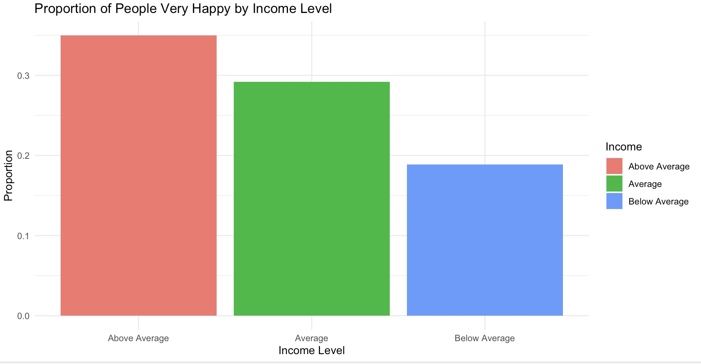
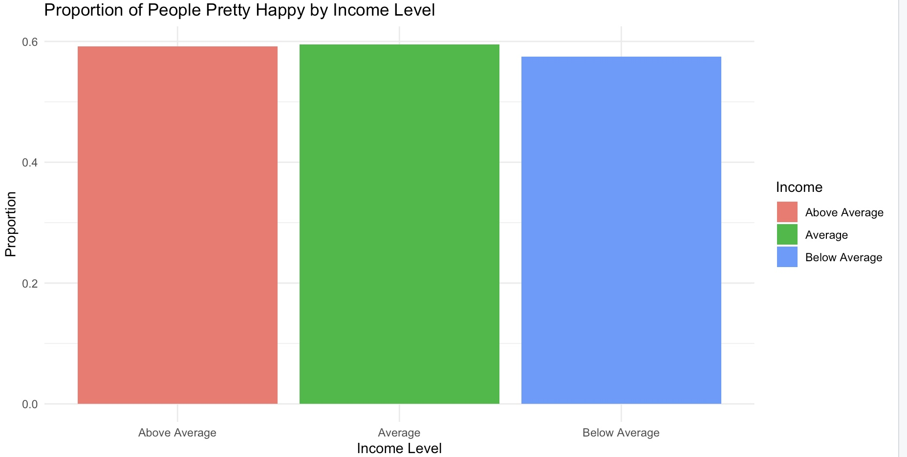
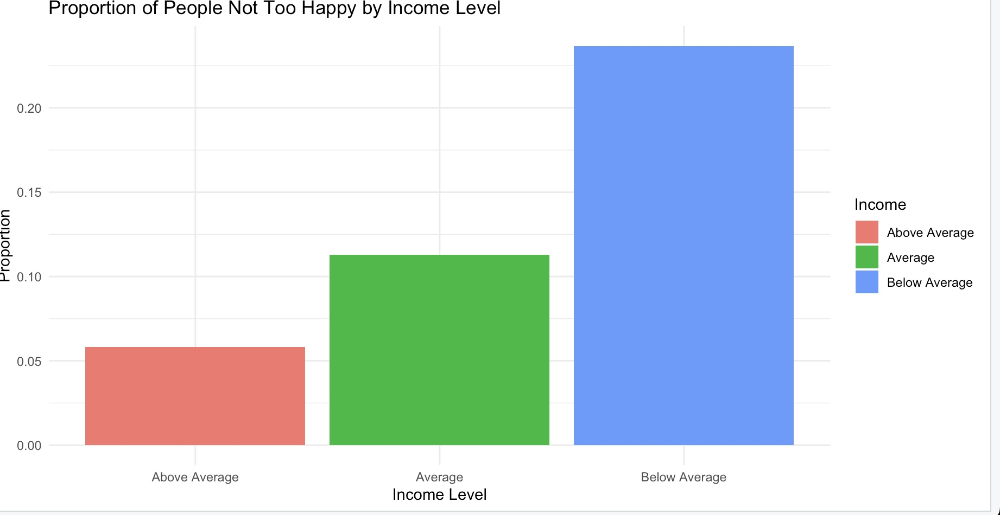
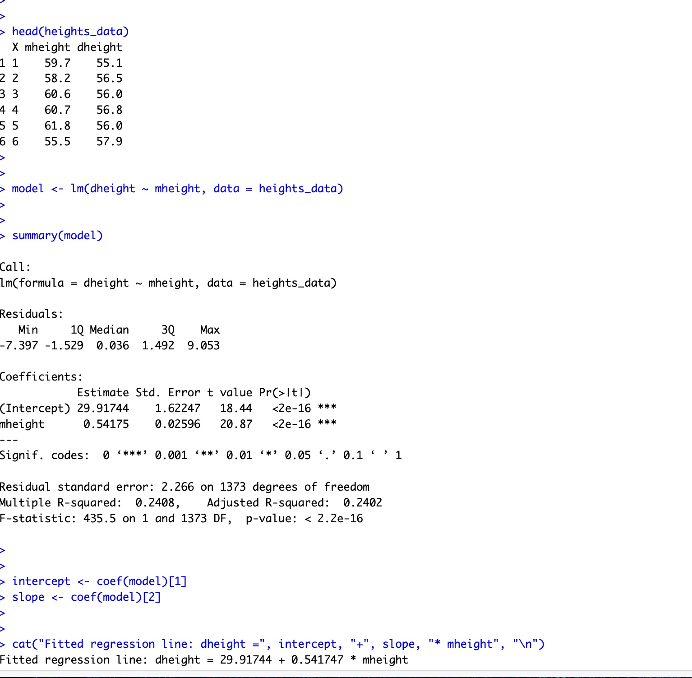
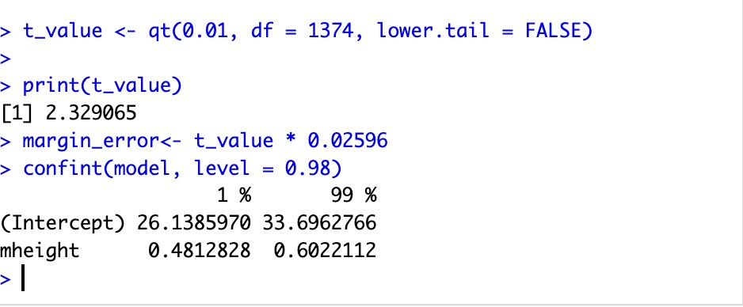
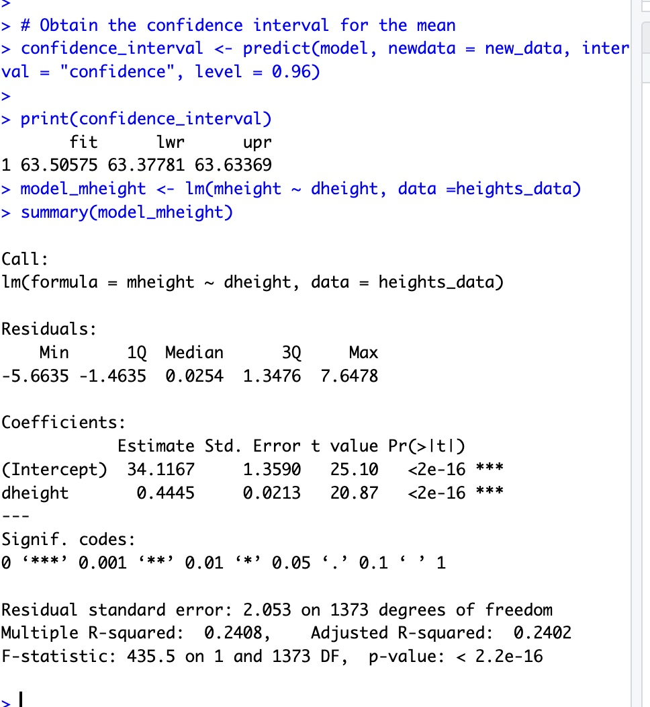
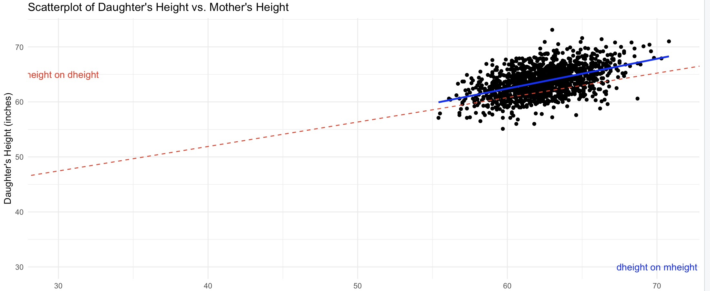
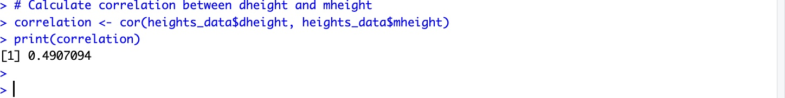

# ** MTH 542 HW2 Esteban Morales**

# Problem 1.

## (a) 
The response variable is the happiness and the explanatory varialble is family income.

## (b)

###Summary of Results:

Income Level	|.   Not Too Happy |	Pretty Happy |	Very Happy

Above Average	0.058	,            0.592,	              0.350

Average	                0.113	,            0.595,	              0.292

Below Average	0.237,	            0.574,	              0.189

We can notice that as income increases, the proportion of those who report "Not Too Happy" decreases.

For those that selected "Pretty Happy", as income increased, the proportion remained relatively constant and did not change at around 58%.

Finally, as income increases, the proportino of those who selected "Very Happy" increases.

There appears to be an association between income and happiness. People with higher income levels are more likely to report eing "Very Happy" and less likely to report being "Not Too Happy". The inverse is true for those with below average incomes. at all levels of income however, the "Pretty Happy" response seemed to stay about the same.

## (c) 
If we observed that our conditional proportions were uniform across all income levels — meaning that changing the income level would not affect the likelihood of selecting a happiness level — then we would conclude that there is no association between the two variables.

## (d)

# Problem 2.

## (a)

The slope of the fitted regression line can be interpretted as the expected increase of the daughters height given a increase of 1 in the mothers height.

The intercept of the fitted regression line can be understood as the expected height of the daughter when the mother's height is 0. In this instance, this has no actual meaning(a height of 0 is meaningless) but in other contexts (age, number of cardiac events occuring) it could have a useful meaning. It is important to note that the intercept is usually outside of the range of the data, so drawing conclusions from the intercept should be taken with a grain of salt.

## (b)

We are 98% confident that the true slope of the simple linear regression model is contained by the interval (0.481, 0.602). We used a method that in the long run, will capture the true slope 98% of the time.

## (c)
 62.42226. This result comes from using the SLR model and plugging in 60 for the mheight.

## (d)
 (60.3, 57.9) The expected value of the daughters height when the mothers height is 60.3 is 62.5847841. The residual is         57.9 - 62.5847841  = -4.6847841. This indicates that the actual height is below what our model predicts, as it is negative. To be precise, it is -4.684 inches below what our model predicts.

## (e)
 The prediction interval is (58.845, 68.166). We are 96% confident that the height of a daugher whose mother is 62 inches will fall between approximately 58.845in and 68.166in.

## (f)
 We are 96% confident that the mean height of daughters whose mothers are 62 inches tall will fall between 63.377 and 63.63369

## (g)

The intercept represents the estimated mother's height when the daugher's heigh is zero, this makes no sense in our context. The slope indicates the expected change in the mothers height for each increase of 1 in the daughters height.

## (h)

The red line uses mheight on dheight, and as such uses the variability of the mheight to try and explain/predict the dheight. The inverse is true for the blue line. As a result, the blue linehas a larger slope as there is more variability in the dheight with regards to our SLR.

## (i)

The standard deviation of dheight is 2.60 and the standard deviation of mheight is 2.355. We know that the formula for pearson's correlation coefficient,r, is dependent on both of these values. Specifically, b_1 is r *S_dheight / S_mheight and b_2 is r *S_mheight/S_dheight.
the standard deviations directly impact the value of r, while also taking the value of b_i into consideration as a scalar of S_y / S_x.

## (j)
if we were to change units, the heights would be larger, ~2.54 times to be exact. This would have no effect on r since it is unitless and a linear combination/transformation would have no effect on the ratio of the standard deviations. The change of units would also have no effect on our model estimator b_1 since it is again a slope that would stay the same as it is a ratio. our b_0 would change as it is being scaled by 2.54
